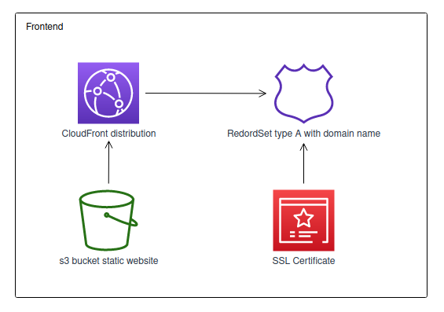
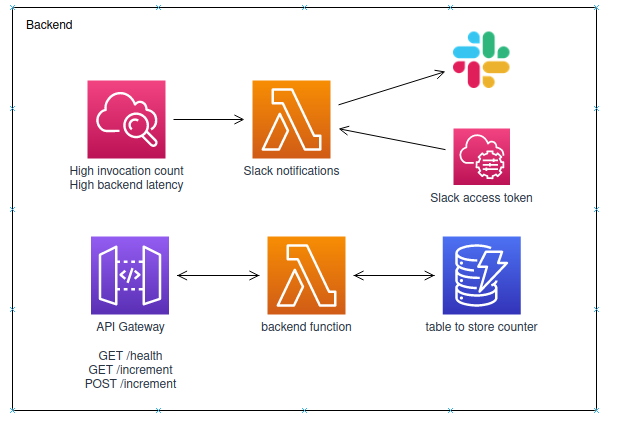
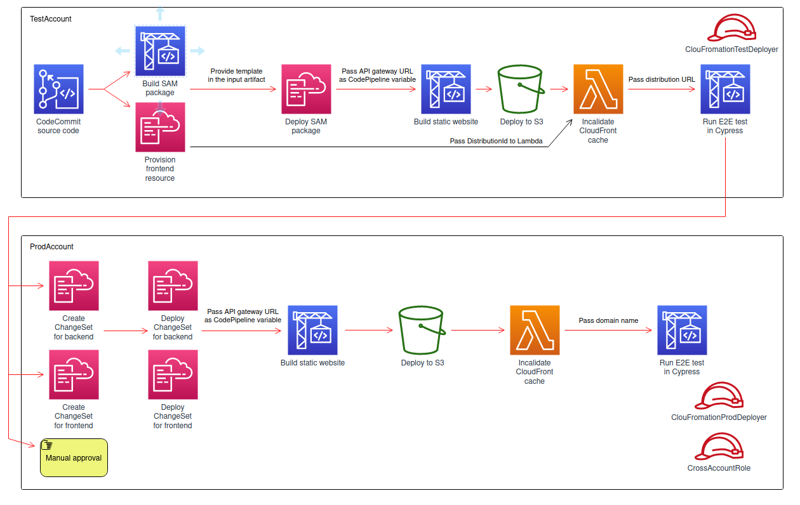

# cloud-resume-challenge

The Cloud Resume Challenge is a multiple-step resume project which helps 
build and demonstrate skills fundamental to pursuing a career as an AWS Cloud Engineer.

You can access my resume on https://kzwolenik.com/resume/

This github repository is a public copy of the code, my pipeline is configured to use CodeCommit as a source

### Detailed description

Frontend is a simple static website hosted on **s3 bucket** with **CloudFront distribution** 
on top to take advantage of Edge locations, in addtion, on the PROD environment **Route53** 
and **AWS Certificate Manager** were used to configure acces by domain name.

The author of the challenge suggest to add a visit counter to the page to add a little bit 
of complexity, this was realized by **Lambda function** behind an **API Gateway** that 
stored its state in **DynamoDB** table. In addition, in the backend package I have added
additional Lambda to handle **CloudWatch** events and send them to Slack, I have stored
Slack auth tokens in **AWS Systems Manager**

Whole project is deployed using one **CodePipeline**, this pipeline first builds and 
deploys everything to TEST, run Cypress smoke tests, prepares ChangeSets and after a 
manual approval it continues the deployment to the PROD with a very similar steps 
as in TEST. Frontend and backend is stored as *Infrastructure as code* in **CloudFromation** 
templates

